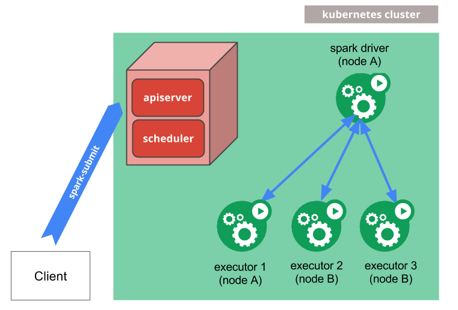
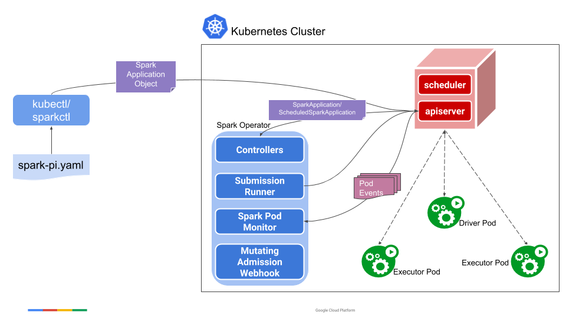
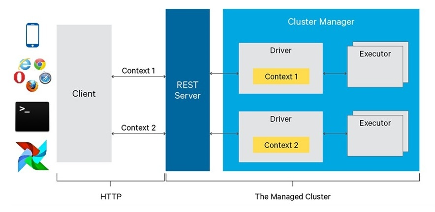

Most of the big data applications need multiple services likes HDFS, YARN, Spark and their clusters. 
Solutions like EMR, Databricks etc help us to simplify the deployment. But then users will be locked into those specific services. These distributed systems require a cluster-management system to handle tasks such as checking node health and scheduling jobs. With the Apache Spark, you can run it like a scheduler YARN, Mesos, standalone mode or now Kubernetes, which is now experimental.

There are many ways to deploy Spark Application on Kubernetes:
 1. `spark-submit` directly submit a Spark application to a Kubernetes cluster
 2. Using [Spark Operator](https://github.com/GoogleCloudPlatform/spark-on-k8s-operator)
 3. Using Livy to Submit Spark Jobs on Kubernetes


# YARN pain points

- Management is difficult
- Complicated OSS software stack: version and dependency management is hard.
- Isolation is hard

# Why Spark on Kubernetes

Spark can run on clusters managed by Kubernetes. This feature makes use of native Kubernetes scheduler that has been added to Spark. Kubernetes offers some powerful benefits as a resource manager for Big Data applications, but comes with its own complexities.

It is using custom resource definitions and operators as a means to extend the Kubernetes API. So far, it has open-sourced operators for Spark and Apache Flink, and is working on more.

Here are three primary benefits to using Kubernetes as a resource manager:
- Unified management — Getting away from two cluster management interfaces if your organization already is using Kubernetes elsewhere.
- Ability to isolate jobs — You can move models and ETL pipelines from dev to production without the headaches of dependency management.
- Resilient infrastructure — You don’t worry about sizing and building the cluster, manipulating Docker files or Kubernetes networking configurations.


## 1. `spark-submit` directly submit a Spark application to a Kubernetes cluster

`spark-submit` can be directly used to submit a Spark application to a Kubernetes cluster. The submission mechanism works as follows:

- Spark creates a *Spark driver* running within a [Kubernetes pod](https://kubernetes.io/docs/concepts/workloads/pods/pod/).
- The driver creates executors which are also running within Kubernetes pods and connects to them, and executes application code.
- When the application completes, the executor pods terminate and are cleaned up, but the driver pod persists logs and remains in “completed” state in the Kubernetes API until it’s eventually garbage collected or manually cleaned up.




For example to launch Spark Pi in cluster mode:

```shell
$ bin/spark-submit \
    --master k8s://https://<k8s-apiserver-host>:<k8s-apiserver-port> \
    --deploy-mode cluster \
    --name spark-pi \
    --class org.apache.spark.examples.SparkPi \
    --conf spark.executor.instances=5 \
    --conf spark.kubernetes.container.image=<spark-image> \
    local:///path/to/examples.jar
```

More detail at: [https://spark.apache.org/docs/latest/running-on-kubernetes.html](https://spark.apache.org/docs/latest/running-on-kubernetes.html)


## 2. Using Spark Operator

The [Kubernetes Operator](https://github.com/GoogleCloudPlatform/spark-on-k8s-operator) for Apache Spark aims to make specifying and running Spark applications as easy and idiomatic as running other workloads on Kubernetes. It uses Kubernetes custom resources for specifying, running, and surfacing status of Spark applications. 

The easiest way to install the [Kubernetes Operator](https://github.com/GoogleCloudPlatform/spark-on-k8s-operator) for Apache Spark is to use the Helm chart.

```shell
$ helm repo add incubator http://storage.googleapis.com/kubernetes-charts-incubator
$ helm install incubator/sparkoperator --namespace spark-operator
```

This will install the Kubernetes Operator for Apache Spark into the namespace `spark-operator`. The operator by default watches and handles SparkApplications in every namespaces.



To config the Spark Application, we defines an YAML file:

```yaml
# spark-pi.yaml

apiVersion: "sparkoperator.k8s.io/v1beta2"
kind: SparkApplication
metadata:
  name: spark-pi
  namespace: default
spec:
  type: Scala
  mode: cluster
  image: "gcr.io/spark-operator/spark:v2.4.5"
  imagePullPolicy: Always
  mainClass: org.apache.spark.examples.SparkPi
  mainApplicationFile: "local:///opt/spark/examples/jars/spark-examples_2.11-2.4.5.jar"
  sparkVersion: "2.4.5"
  restartPolicy:
    type: Never

  driver:
    cores: 1
    coreLimit: "1200m"
    memory: "512m"
    labels:
      version: 2.4.5
    serviceAccount: spark
  executor:
    cores: 1
    instances: 1
    memory: "512m"
    labels:
      version: 2.4.5

```

Note that `spark-pi.yaml` configures the driver pod to use the spark service account to communicate with the Kubernetes API server. 

To run the Spark Pi example, run the following command:

```shell
$ kubectl apply -f spark-pi.yaml
```

Refs:
 - https://github.com/GoogleCloudPlatform/spark-on-k8s-operator
 - [Quick Start Guide](https://github.com/GoogleCloudPlatform/spark-on-k8s-operator/blob/master/docs/quick-start-guide.md)

## 3. Using Livy

Apache Livy is a service that enables easy interaction with a Spark cluster over a REST interface. 
The cons is that Livy is written for Yarn. But Yarn is just Yet Another resource manager with containers abstraction adaptable to the Kubernetes concepts. Under the hood Livy parses POSTed configs and does `spark-submit` for you, bypassing other defaults configured for the Livy server.


The high-level architecture of Livy on Kubernetes is the same as for Yarn.



After the job submission Livy discovers Spark Driver Pod scheduled to the Kubernetes cluster with Kubernetes API and starts to track its state, cache Spark Pods logs and details descriptions making that information available through Livy REST API, builds routes to Spark UI, Spark History Server, Monitoring systems with Kubernetes Ingress resources, Nginx Ingress Controller in particular and displays the links on Livy Web UI.

The basic Spark on Kubernetes setup consists of the only Apache Livy server deployment, which can be installed with the Livy Helm chart.

```shell
helm repo add jahstreet https://jahstreet.github.io/helm-charts
kubectl create namespace spark-jobs
helm upgrade --install livy --namespace spark-jobs jahstreet/livy
```

Now when Livy is up and running we can submit Spark job via [Livy REST API](https://livy.incubator.apache.org/docs/latest/rest-api.html).

```shell
kubectl exec livy-0 -- \
    curl -s -k -H 'Content-Type: application/json' -X POST \
      -d '{
            "name": "SparkPi-01",
            "className": "org.apache.spark.examples.SparkPi",
            "numExecutors": 2,
            "file": "local:///opt/spark/examples/jars/spark-examples_2.11-2.4.5.jar",
            "args": ["10000"],
            "conf": {
                "spark.kubernetes.namespace": "livy"
            }
          }' "http://localhost:8998/batches" | jq
```

To track the running Spark job we can use all the available Kubernetes tools:

```shell
$ k get pod

NAME                                          READY   STATUS         RESTARTS   AGE
livy-0                                        1/1     Running        0          3h
sparkpi01aasdbtyovr-1590286117050-driver      1/1     Running        0          1m
sparkpi01aasdbtyovr-1590286117050-exec-1      1/1     Running        0          1m
sparkpi01aasdbtyovr-1590286117050-exec-2      1/1     Running        0          1m
sparkpi01aasdbtyovr-1590286117050-exec-3      1/1     Running        0          1m
sparkpi01aasdbtyovr-1590286117050-exec-4      1/1     Running        0          1m
sparkpi01aasdbtyovr-1590286117050-exec-5      1/1     Running        0          1m
```

or the Livy REST API: 

```shell
k exec livy-0 -- curl -s http://localhost:8998/batches/$BATCH_ID | jq
```

With Livy, we can easy to integrate with [Apache Airflow](/tag/airflow/) to manage Spark Jobs on Kubernetes at scale.

Refs: https://github.com/jahstreet/spark-on-kubernetes-helm