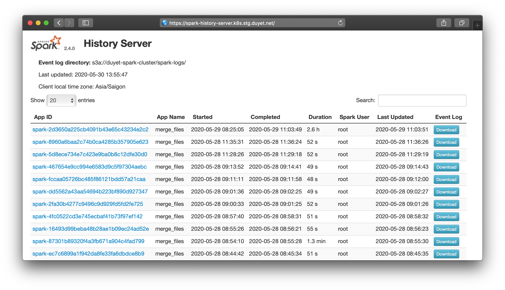

The problem with running Spark on Kubernetes is the logs go away once the job completes. Spark has tool called the Spark History Server that provides a UI for your past Spark jobs. When you running [Spark with Livy on Kubernetes](/2020/05/spark-on-k8s.html) or direct `spark-submit`, `Spark Driver` keeps event logs while running, but after a Spark application is finished `Spark Driver` exits, so these are lost unless you enable event logging and set a folder where the logs are placed. One option is to start `Spark History Server`, and point it to the same log directory so you'll be able to reach your application logs post-execution

In this post, I will show you how to use Spark History Server on Kubernetes.

# 1. Enabling `spark-submit` to log events

The history server UI would only show Spark jobs if they are configured to log events to the same location that Spark history server is tracking.

> A PVC, HDFS, S3, GCS, WASBS can be used as storage for Spark logs.

### GCS

In the case of GCS, the secret needs to be mounted in the driver and executor pods using the configuration options `spark.kubernetes.driver.secrets.[SecretName]` and `spark.kubernetes.executor.secrets.[SecretName]`. A sample command is given below:

```bash
bin/spark-submit \
    --master k8s://https://<k8s-master-url> \
    --deploy-mode cluster \
    --name spark-pi \
    --class org.apache.spark.examples.SparkPi \
    --conf spark.eventLog.enabled=true \
    --conf spark.eventLog.dir=gs://spark-hs/ \
    --conf spark.executor.instances=1 \
    --conf spark.hadoop.google.cloud.auth.service.account.json.keyfile=/etc/secrets/sparkonk8s.json \
    --conf spark.kubernetes.driver.secrets.history-secrets=/etc/secrets \
    --conf spark.kubernetes.executor.secrets.history-secrets=/etc/secrets \
    --conf spark.kubernetes.container.image=lightbend/spark-history-server:2.4.0 \
    local:///opt/spark/examples/jars/spark-examples_2.11-2.4.0.jar
```

### S3

In the case of S3, it is recommended to use IAM based authentication. The IAM role should have equivalent access to AmazonS3FullAccess. To write event logs to S3, you need to provide configs as below:

```bash
in/spark-submit \
    --master k8s://https://<k8s-master-url> \
    --deploy-mode cluster \
    --name spark-pi \
    --class org.apache.spark.examples.SparkPi \
    --conf spark.eventLog.enabled=true \
    --conf spark.eventLog.dir=s3a://spark-hs/ \
    --conf spark.kubernetes.container.image=lightbend/spark-history-server:2.4.0 \
    local:///opt/spark/examples/jars/spark-examples_2.11-2.4.0.jar
```

When not using the IAM based authentication, you need to provide additional configs for authentication as below:

```bash
--conf spark.hadoop.fs.s3a.access.key=your-AWS-access-key-ID \
--conf spark.hadoop.fs.s3a.secret.key=your-AWS-secret-access-key
```

### HDFS

In the case of HDFS, only two flags are required:

```bash
--conf spark.eventLog.enabled=true
--conf spark.eventLog.dir=hdfs://hdfs/history/
```

# 2. Installing the Spark History Server Chart

To install the chart with S3 support:

```bash
$ helm repo add stable https://kubernetes-charts.storage.googleapis.com
$ helm install -f values.yaml stable/spark-history-server --namespace spark-history-server
```

With `values.yaml`:

```yaml
s3:
  enableS3: true
  enableIAM: true
  logDirectory: s3a://spark-hs/
  # accessKeyName is an AWS access key ID. Omit for IAM role-based or provider-based authentication.
  accessKeyName: aws-access-key
  # secretKey is AWS secret key. Omit for IAM role-based or provider-based authentication.
  secretKeyName: aws-secret-key

gcs:
  enableGCS: false
  logDirectory: gs://spark-hs/

pvc:
  enablePVC: false

nfs:
  enableExampleNFS: false

service:
  type: NodePort
  port: 18080
  annotations: {}
```

For details about installing the chart to use others storage, see configurations options [here](https://github.com/helm/charts/tree/master/stable/spark-history-server#configurations).

**Viewing the UI:** After the chart is successfully installed, a message would be printed out to the console with details about how to access the UI. Depending on what `service.type` is specified, different instructions would be presented on the console. Valid `service.type` values are `LoadBalancer`, `NodePort` and `ClusterIP`.

From above config, you should able to access the UI via: http://[nodeIp]:18080



# References

- https://github.com/helm/charts/tree/master/stable/spark-history-server