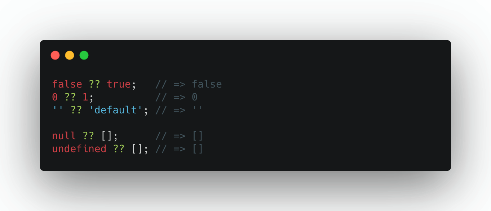

The [nullish coalescing proposal](https://github.com/tc39/proposal-nullish-coalescing/) (`??`) adds a new short-circuiting operator meant to handle default values.


The nullish coalescing operator (`??`) acts very similar to the `||` operator, except that we don’t use *"truthy"* when evaluating the operator. Instead we use the definition of *"nullish"*, meaning "is the value strictly equal to null or undefined". So imagine the expression `lhs ?? rhs`: if `lhs` is not nullish, it evaluates to `lhs`. Otherwise, it evaluates to rhs.

```js
false ?? true;   // => false
0 ?? 1;          // => 0
'' ?? 'default'; // => ''

null ?? [];      // => []
undefined ?? []; // => []
```


# References
 - https://github.com/tc39/proposal-nullish-coalescing/
 - https://v8.dev/features/nullish-coalescing