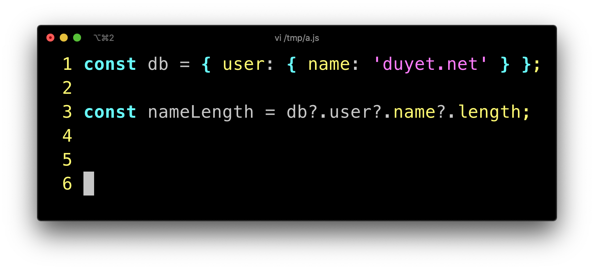

Long chains of property accesses in JavaScript can be error-prone, as any of them might evaluate to null or undefined (also known as "nullish" values). Some other languages offer an elegant solution to this problem with using a feature called "optional chaining".

Optional chaining syntax allows you to access deeply nested object properties without worrying if the property exists or not. If it exists, great! If not, undefined will be returned.


Before:
```js
const nameLength =
  (db
    ? (db.user
      ? (db.user.name
        ? db.user.name.length
        : undefined)
      : undefined)
    : undefined);
```

After:
```js
const nameLength = db?.user?.name?.length;
```

# References
 - https://github.com/tc39/proposal-optional-chaining
 - https://v8.dev/features/optional-chaining